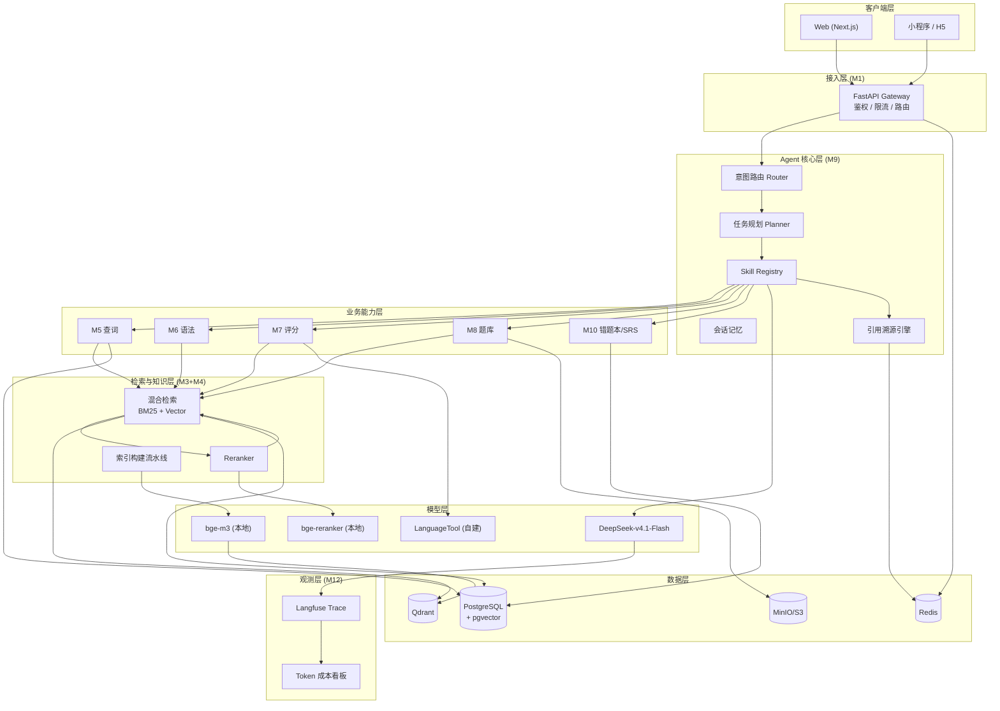
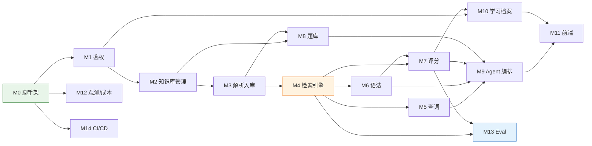

# 英语老师智能 AI Agent —— 产品需求文档（PRD）与技术方案

> **历史文档：已由 [`英语老师AI-Agent-统一产品与技术开发方案.md`](英语老师AI-Agent-统一产品与技术开发方案.md) 替代。该文档的 Web/SaaS 架构不再是当前实现方向；仅用于追溯产品分析。**

> 产品代号：**EngMentor（英师）**
> 文档类型：PRD + 技术架构设计 + 研发计划（三合一）
> 版本：v1.0
> 编制：产品通（产品管理专家）
> 日期：2026-09-19
> 状态：待评审

---

## 目录

- [0. 一页纸摘要（TL;DR）](#0-一页纸摘要tldr)
- [1. 背景与问题陈述](#1-背景与问题陈述)
- [2. 目标与非目标](#2-目标与非目标)
- [3. 用户画像与核心场景](#3-用户画像与核心场景)
- [4. 功能需求详述](#4-功能需求详述)
- [5. 补充功能建议（你问的"还缺什么"）](#5-补充功能建议你问的还缺什么)
- [6. 优先级划分](#6-优先级划分)
- [7. 技术选型](#7-技术选型)
- [8. 系统架构与模块划分](#8-系统架构与模块划分)
- [9. 牛津词典 RAG 方案与 Token 成本控制（核心章节）](#9-牛津词典-rag-方案与-token-成本控制核心章节)
- [10. 数据模型与 API 设计](#10-数据模型与-api-设计)
- [11. 研发迭代计划](#11-研发迭代计划)
- [12. GitHub 协作与 CI/CD](#12-github-协作与-cicd)
- [13. 开发过程中适用的 Skills 清单](#13-开发过程中适用的-skills-清单)
- [14. 指标体系](#14-指标体系)
- [15. 风险、合规与版权（重要）](#15-风险合规与版权重要)
- [16. 验收标准](#16-验收标准)
- [17. 待决问题（Open Questions）](#17-待决问题open-questions)

---

## 0. 一页纸摘要（TL;DR）

| 维度 | 结论 |
|------|------|
| **一句话定位** | 一个"能选教材、能改作文、能讲语法、能查词并标明出处"的英语学习 Agent 平台 |
| **核心差异化** | ①知识库可插拔（不同词书/语法书/题库都能挂）②所有答案强制标注来源 ③作文评分按官方 rubric 给分项分而非"感觉" |
| **MVP 范围** | 查词（带来源）+ 知识库选择 + 语法讲解 + 作文/句子评分 |
| **首发不做** | 口语实时对话、教师管理后台、社区、移动端原生 App |
| **技术主线** | Next.js + FastAPI + PostgreSQL/pgvector + Redis + DeepSeek-v4.1-Flash + 本地 bge-m3 嵌入 |
| **成本关键** | 分层路由：80% 的词典类请求走 **确定性结构化查询（0 Token）**，只有语义/生成类任务才调用 LLM |
| **最大风险** | **牛津词典是商业版权内容**，未经授权不得作为商用知识库分发 → 见第 15 章 |
| **开发方式** | 单体仓库（Monorepo）+ 14 个模块 + 4 个迭代批次，全程 GitHub 分支保护 + CI |

---

## 1. 背景与问题陈述

### 1.1 问题陈述

英语学习者在自学过程中面临三个割裂的困境：

1. **工具割裂**：查词用一个 App、改作文用另一个、语法学习又靠搜索引擎，学习数据不沉淀，无法形成反馈闭环。
2. **答案不可信**：通用大模型会"编造"释义、拼错固定搭配、给出不存在的例句，学习者**无法验证**，长期使用会固化错误。
3. **反馈不结构化**：市面上的 AI 作文批改大多只给一个总分和一段笼统评语，学习者不知道"我到底差在哪、下一句该怎么改、哪个语法点是根因"。

同时，教师的教辅资产（自编题库、讲义、词表）无法进入 AI 工具，AI 只能回答"通用英语"，回答不了"我们这本教材的英语"。

### 1.2 影响面与代价

| 痛点 | 现状代价 |
|------|---------|
| 答案无出处 | 用户需要二次求证，学习效率下降；错信 AI 幻觉导致考试丢分 |
| 无结构化评分 | 写作进步无法量化，用户无法感知"我变好了"，留存差 |
| 知识库不可选 | 无法服务 K12 校本教材、雅思/托福、四六级等**分场景需求**，商业化天花板低 |
| 教辅资产无法导入 | 教师/机构客户无法接入，B 端变现路径被堵 |

### 1.3 证据与前置假设

> ⚠️ 以下为立项假设，**必须在 Phase 0 用 5-8 场用户访谈验证**，不得直接当作已确认结论。

- 假设 A：学习者最常被质疑的不是"AI 会不会改"，而是"AI 改得对不对"。
- 假设 B：教师愿意上传自编题库，前提是解析准确率 > 90% 且有校对界面。
- 假设 C：用户对"评分"的付费意愿显著高于对"讲解"的付费意愿。

**验证方法**：Phase 0 招募 5 名自学者 + 3 名英语教师，做任务式访谈（Task-based Interview），记录他们现有的查词/批改工作流。

---

## 2. 目标与非目标

### 2.1 产品目标（Outcome，非 Output）

| # | 目标 | 衡量方式 | 成功阈值 | 拉伸目标 |
|---|------|---------|---------|---------|
| G1 | 让用户信任 AI 的每一次回答 | 有来源标注的回答占比 / 用户"来源有用"点赞率 | ≥ 95% / ≥ 60% | 100% / 75% |
| G2 | 让写作进步可量化 | 用户 4 周内作文评分提升幅度 | +0.5 分（10 分制） | +1.0 分 |
| G3 | 让知识库成为可插拔的一等公民 | 至少 3 类知识库可正常切换且答案随之改变 | 3 类 | 6 类 |
| G4 | 控制单位成本 | 单次会话平均 Token 成本 | ≤ ¥0.05 | ≤ ¥0.02 |
| G5 | 建立学习闭环 | 7 日留存 / 周均有效会话数 | ≥ 30% / ≥ 3 次 | ≥ 45% / ≥ 5 次 |

### 2.2 商业目标

- B1：跑通"免费查词 + 付费批改"的转化路径，付费转化率 ≥ 3%。
- B2：验证教师/机构侧知识库上传的价值，签下 ≥ 2 个试点机构。

### 2.3 非目标（Non-Goals，明确不做）

| 非目标 | 为什么不做 |
|--------|-----------|
| ❌ 不做实时语音口语对话（v1） | ASR + 音素级评测链路复杂，且与"文本批改"核心价值不重合，会拖垮 MVP 节奏 |
| ❌ 不做完整课程体系 / 直播课 | 这是内容运营业务，不是 Agent 产品；应通过接入第三方课程解决 |
| ❌ 不做社交社区 / 学习排行榜（v1） | 冷启动阶段无社交密度，做出来是空壳；且引入内容审核成本 |
| ❌ 不做自有移动原生 App（v1） | 先用响应式 Web + 小程序验证需求，避免双端维护 |
| ❌ 不做自动出卷 / 全自动题库生成 | 出卷质量不可控，容易产出错误题目；v1 只做"上传-解析-校对-入库" |
| ❌ 不承诺"替代真人教师" | 定位是"陪练 + 反馈工具"，过度承诺会带来合规与口碑风险 |

---

## 3. 用户画像与核心场景

### 3.1 Persona

| Persona | 描述 | 核心诉求 | 关键场景 |
|---------|------|---------|---------|
| **P1 备考冲刺生（小李，高三/大三）** | 目标明确、时间紧、刷题量大 | 快速批改 + 精准指出丢分点 | 写完作文 → 拍照/粘贴 → 3 分钟内拿到分项分和逐句批注 |
| **P2 职场英语自学者（Amy，28 岁 PM）** | 碎片时间、重实用、怕出错 | 查词要准、要有出处、要能看懂怎么说才地道 | 写英文邮件 → 让 AI 改 → 问"这个搭配商务场合用合适吗" |
| **P3 英语教师（王老师）** | 有自编题库和讲义，想提效 | 把自己的题和学生数据接进来 | 上传《校本语法练习.docx》→ 校对解析 → 分发给学生 |
| **P4 K12 学生家长** | 关注结果，不参与操作 | 看到孩子的进步曲线 | 周报：本周学习时长、错题 TOP 3、作文分数变化 |

### 3.2 用户旅程（P1 备考冲刺生）

```
输入句子/作文
   ↓
① 选择知识库（默认：牛津词典 + 通用语法库；可切"雅思写作 7 分范文库"）
   ↓
② 提交（粘贴文本 / 上传文件 / 拍照 OCR）
   ↓
③ 系统返回：
   ├─ 总分 + 5 个分项分（内容/结构/词汇/语法/连贯）
   ├─ 逐句批注（错误定位 + 原因 + 修改建议）
   ├─ 涉及语法点 → 一键跳转语法讲解（出处：语法库《XX》第 N 章）
   └─ 用词建议 → 关联词条（出处：牛津词典第 9 版 word 条，释义 3）
   ↓
④ 一键加入错题本 → 系统排入 SRS 复习计划
   ↓
⑤ 4 周后看进步曲线
```

---

## 4. 功能需求详述

> 每个功能给出：问题背景 → 用户故事 → 需求条目（P0/P1/P2）→ 验收标准

### 4.1 F1 知识库管理与选择

**背景**：不同用户学的是不同"英语"。牛津词典、校本教材词表、雅思范文库，语义空间不同，必须可插拔。

**用户故事**

- 作为备考冲刺生，我希望**选择与考试匹配的知识库**，以便 AI 给出的词汇建议是对准考纲的。
- 作为英语教师，我希望**创建自己的知识库并上传资料**，以便 AI 用我们教材的术语和例句回答学生。
- 作为新用户，我希望**开箱即用有一个默认知识库**，以便不用配置就能提问。

**需求条目**

| 编号 | 需求 | 优先级 |
|------|------|--------|
| F1-1 | 系统内置默认知识库（牛津词典 + 通用语法库），首次使用无需配置 | P0 |
| F1-2 | 用户可在会话级切换知识库，切换后左上角持续显示当前 KB 名称 | P0 |
| F1-3 | 支持"多库联合检索"，用户可勾选多个 KB 组成一个检索集 | P0 |
| F1-4 | 知识库列表页：展示名称、类型、词条/条目数、最后更新时间 | P0 |
| F1-5 | 用户可创建自定义 KB（命名 + 描述 + 上传资料） | P1 |
| F1-6 | 知识库可见性：私有 / 团队共享 / 公开 | P1 |
| F1-7 | 知识库版本管理（可回滚到上一版本） | P2 |
| F1-8 | 知识库健康度报告（覆盖率、解析失败率、过期词条占比） | P2 |

**知识库类型（设计上必须可扩展）**

| 类型 | 示例 | 检索方式 |
|------|------|---------|
| `DICTIONARY` 词典型 | 牛津词典、ECDICT、专业术语表 | 结构化精确匹配优先 |
| `GRAMMAR` 语法型 | 语法书、语法大纲、常见错误集 | 按语法点索引 + 语义检索 |
| `CORPUS` 语料/范文型 | 雅思 7 分范文、商务邮件模板 | 纯语义检索 |
| `QUESTION_BANK` 题库型 | 用户上传的练习册 | 结构化题目检索 |
| `RUBRIC` 评分标准型 | 雅思/高考评分细则 | 全量注入 Prompt（条目少） |

**验收标准**

- [ ] Given 用户未做任何配置，When 首次提问"abandon 什么意思"，Then 返回牛津词典释义且标注来源
- [ ] Given 用户把知识库从"牛津词典"切到"雅思范文库"，When 问"这个短语地道吗"，Then 答案依据变为范文库，来源标注同步变化
- [ ] Given 用户勾选 2 个以上知识库，When 提问，Then 返回结果分别标注来自哪个 KB
- [ ] Given 知识库正在重建索引，When 用户提问，Then 提示"索引更新中，当前使用上一版本"而非报错

---

### 4.2 F2 写作 / 句子评分

**背景**：这是产品的付费核心。市面产品给总分，我们要给**分项分 + 逐句批注 + 根因语法点**。

**用户故事**

- 作为备考冲刺生，我希望**作文按考试官方标准分项打分**，以便我知道哪一项拖了后腿。
- 作为学习者，我希望**看到每一句的具体问题**，以便我知道下一句该怎么写。
- 作为学习者，我希望**知道错误背后的语法根因**，以便我能系统性补上，而不是背答案。
- 作为学习者，我希望 **AI 不要瞎改**，如果我的句子没错就别乱改。

**评分维度（Rubric）**

| 维度 | 权重（雅思类） | 权重（K12 通用） | 说明 |
|------|--------------|----------------|------|
| 内容切题 Content | 25% | 30% | 是否覆盖任务要点、论点是否有支撑 |
| 结构组织 Organization | 25% | 20% | 段落逻辑、首尾、过渡 |
| 词汇 Lexical Resource | 25% | 20% | 丰富度、准确性、搭配 |
| 语法 Grammatical Range & Accuracy | 25% | 25% | 句式多样性、错误密度 |
| 连贯衔接 Cohesion | 计入结构 | 5% | 连接词使用是否自然 |

**需求条目**

| 编号 | 需求 | 优先级 |
|------|------|--------|
| F2-1 | 支持粘贴文本评分，返回总分 + 分项分 + 逐句批注 | P0 |
| F2-2 | 用户可选择评分标准（高考 / 中考 / 雅思 / 四六级 / 自定义） | P0 |
| F2-3 | 逐句批注必须包含：原句、问题类型、原因、修改建议（可点击"接受修改"） | P0 |
| F2-4 | 错误归类与语法点关联（点击跳转语法讲解） | P0 |
| F2-5 | **确定性预检**：拼写、标点、主谓一致等用规则引擎先查，避免 LLM 幻觉性纠错 | P0 |
| F2-6 | 上传文件评分（.txt / .md / .docx） | P1 |
| F2-7 | 整篇重写范文 + 逐句对照（diff 视图） | P1 |
| F2-8 | 历史评分记录与进步曲线 | P1 |
| F2-9 | 评分结果导出 PDF 批改报告 | P2 |
| F2-10 | 多轮迭代评分（同一篇作文修改后再评，展示 delta） | P2 |

**技术要点（详见第 9 章）**

- 采用 **"确定性检查 + LLM 高阶评价"双层架构**：
  - 第一层：LanguageTool / 自建规则库做拼写、标点、常见语法错误检测 → 这类结果 **不消耗 Token 且 100% 可复现**
  - 第二层：LLM 只负责"内容切题度、结构、词汇丰富度、句式多样性"等需要理解的任务
- 输出强制 JSON Schema（`response_format: json_object`），后端做 schema 校验与修复
- 温度设为 0.2，同一作文评分 **3 次采样取中位数**（一致性校准），差异 > 15% 则标记"低置信度"

**验收标准**

- [ ] Given 一篇 150 词高考作文，When 提交评分，Then 15 秒内返回 5 项分数 + ≥ 5 条逐句批注
- [ ] Given 一段完全正确的句子 "The quick brown fox jumps over the lazy dog."，When 提交评分，Then **不应**报告任何语法错误（负向测试，防幻觉）
- [ ] Given 批注中提到"虚拟语气"，When 用户点击，Then 跳转语法讲解页并标明出处
- [ ] Given 同一作文连续评分 3 次，When 对比总分，Then 极差 ≤ 1.0 分（10 分制）

---

### 4.3 F3 查词与来源标注

**背景**：用户最基础的诉求，也是建立信任的第一触点。**必须 100% 标注来源**。

**用户故事**

- 作为职场自学者，我希望**查词时看到释义来自哪本词典的哪一版**，以便我能判断可信度。
- 作为学习者，我希望**看到真实例句而不是编造的句子**，以便我学会真实用法。
- 作为学习者，我希望**查词快**，以便不打断我的阅读节奏。

**需求条目**

| 编号 | 需求 | 优先级 |
|------|------|--------|
| F3-1 | 输入单词返回：音标（英/美）、词性、分义项释义、例句、常见搭配 | P0 |
| F3-2 | **来源标注**：词典名 + 版本 + 词条定位（如 `Oxford Advanced Learner's Dictionary, 10th ed., entry: abandon`） | P0 |
| F3-3 | 释义来源与例句来源分别标注（可能来自不同库） | P0 |
| F3-4 | 词形还原（running → run，children → child） | P0 |
| F3-5 | 发音音频（本地音频库优先，TTS 兜底，TTS 结果需标注"AI 合成"） | P1 |
| F3-6 | 上下文释义：粘贴一句话，返回该词在此语境下的义项 | P1 |
| F3-7 | 生词本：一键收藏 + 自动排入 SRS 复习 | P1 |
| F3-8 | 词根词缀拆解（需词源库支持） | P2 |
| F3-9 | 近义词辨析（与图谱库联动） | P2 |

**验收标准**

- [ ] Given 查询 "abandon"，When 返回结果，Then 每条释义后可点击"来源"查看词典出处
- [ ] Given 查询 "runs"，When 返回结果，Then 命中词条 `run` 并提示词形变化
- [ ] Given 词典库中不存在 "asdfgh"，When 查询，Then 明确返回"未收录"，**不得**编造释义
- [ ] Given 查询命中缓存，When 再次查询，Then 响应 < 200ms

---

### 4.4 F4 语法教学

**背景**：语法不能只"讲"，要"诊断 → 归因 → 讲解 → 练习"闭环。

**用户故事**

- 作为学习者，我希望**问"为什么这里要用现在完成时"时得到解释和例句**，以便我真正理解。
- 作为学习者，我希望**我写错的地方能被指出是哪条语法没掌握**，以便针对性补漏。
- 作为学习者，我希望**学完能立刻做几道题检验**，以便确认我真的会了。

**需求条目**

| 编号 | 需求 | 优先级 |
|------|------|--------|
| F4-1 | 语法知识库作为一等公民（与词典库并列，可切换） | P0 |
| F4-2 | 语法点结构化存储：名称、解释、公式/结构、正例、反例、常见错误、关联考点 | P0 |
| F4-3 | 自然语言问答（"现在完成时和一般过去时区别"）→ 返回讲解并标注来源章节 | P0 |
| F4-4 | **诊断模式**：用户提交一段错误句子 → 定位错误 → 关联语法点 → 讲解 | P0 |
| F4-5 | 从作文批改结果一键跳转语法点（与 F2-4 联动） | P0 |
| F4-6 | 每个语法点配 3-5 道配套练习（来自 `QUESTION_BANK`） | P1 |
| F4-7 | 语法学习进度追踪（已掌握 / 待复习） | P1 |
| F4-8 | 语法图谱（前置依赖关系可视化，如"非谓语"依赖"句子成分"） | P2 |

**验收标准**

- [ ] Given 用户提问"虚拟语气的三种用法"，When 返回，Then 结构化列出三种用法且标注语法库来源
- [ ] Given 用户输入 "I have saw him yesterday"，When 诊断，Then 定位到 `have saw` 并关联"现在完成时 + 过去分词"语法点
- [ ] Given 语法讲解返回，When 用户点击"做题检验"，Then 展示 ≥ 3 道相关题（若无题库则提示可上传）

---

### 4.5 F5 题库上传与管理

**背景**：把教师的教辅资产变成 AI 的燃料，是 B 端突破口。

**用户故事**

- 作为英语教师，我希望**上传我的 Word/PDF 练习册**，以便 AI 能基于我的题出题和讲解。
- 作为教师，我希望**解析结果可校对**，以便修正 AI 识别错误，不让学生看到错题。
- 作为教师，我希望**题目自动打上知识点标签**，以便按语法点组卷。

**支持的输入格式**

| 格式 | 解析方案 | 优先级 |
|------|---------|--------|
| `.pdf`（文本层） | PyMuPDF / pdfplumber 抽取 | P0 |
| `.pdf`（扫描件） | 先走 OCR（PaddleOCR / 多模态模型） | P1 |
| `.docx` | python-docx 解析段落/表格 | P0 |
| `.doc`（老格式） | LibreOffice headless 转 docx 后解析 | P0 |
| `.txt` / `.md` | 直接读取 | P1 |
| 图片（拍照） | 多模态 OCR | P2 |

**需求条目**

| 编号 | 需求 | 优先级 |
|------|------|--------|
| F5-1 | 支持上传 pdf / doc / docx，单文件 ≤ 50MB | P0 |
| F5-2 | 自动切分题目：题干、选项、答案、解析、知识点标签 | P0 |
| F5-3 | **人工校对界面**：解析结果与原文对照，支持逐题编辑/删除 | P0 |
| F5-4 | 题目去重（题干指纹 + 编辑距离） | P0 |
| F5-5 | 解析失败时给出明确失败原因（加密 PDF / 无文本层 / 格式异常） | P0 |
| F5-6 | 批量上传与批量校对 | P1 |
| F5-7 | 题目自动标签纠错与标签体系管理 | P1 |
| F5-8 | 按知识点/难度/题型组卷导出 | P2 |
| F5-9 | 题目质量分（AI 置信度 + 教师评分） | P2 |

**验收标准**

- [ ] Given 上传一份 50 题的 `.docx` 语法练习，When 解析完成，Then 正确切分 ≥ 45 题（准确率 ≥ 90%）
- [ ] Given 上传一份 `.doc` 文件，When 解析，Then 系统自动转换并成功抽取
- [ ] Given 上传加密 PDF，When 解析，Then 明确提示"文件已加密，请先解除保护"，不静默失败
- [ ] Given 解析出 50 题，When 教师删除 2 题并修改 3 题，Then 入库 48 题且修改内容持久化
- [ ] Given 上传含重复题目的文件，When 入库，Then 重复题被标记而非静默丢弃

---

### 4.6 F6 Agent 对话编排（贯穿性能力）

**背景**：以上功能不是孤立按钮，而是通过对话统一触达。

**需求条目**

| 编号 | 需求 | 优先级 |
|------|------|--------|
| F6-1 | 意图识别与自动路由（查词 / 语法 / 评分 / 题库 / 闲聊） | P0 |
| F6-2 | 会话上下文记忆（最近 N 轮 + 用户画像摘要） | P0 |
| F6-3 | 引用溯源：所有答案附 `[1][2]` 角标，点击展开来源卡片 | P0 |
| F6-4 | 流式输出（首字 < 1.5s） | P0 |
| F6-5 | 用户可指定 Skill（如 `/score`、`/grammar`、`/dict`） | P1 |
| F6-6 | 追问澄清（信息不足时反问而非瞎猜） | P1 |
| F6-7 | 多轮修改（"把第二段改得更正式"） | P1 |

---

## 5. 补充功能建议（你问的"还缺什么"）

> 以下按"补齐学习闭环"的逻辑分组，标注建议优先级。

### 5.1 学习闭环类（强烈建议补）

| # | 功能 | 为什么需要 | 优先级 |
|---|------|-----------|--------|
| S1 | **错题本** | 没有错题沉淀，用户下次还错同一个点；也是复购抓手 | **P0** |
| S2 | **间隔重复复习（SRS / SM-2 算法）** | 词汇和语法点的记忆必须靠遗忘曲线，否则"学过 = 没学过" | **P0** |
| S3 | **学习档案 / 进步曲线** | 让"我变好了"可视化，这是留存的核心驱动力（对应目标 G2/G5） | **P1** |
| S4 | **个性化学习计划** | 用户输入目标（"3 个月雅思 6.5"）→ 生成周计划 → 每日任务 | P1 |
| S5 | **薄弱点诊断报告** | 从历史批改数据中聚类出"你最常错的三类"，直接指导复习 | P1 |
| S6 | **词汇量测试（自适应）** | 拉新钩子 + 建立用户基线数据 | P2 |

### 5.2 能力扩展类

| # | 功能 | 为什么需要 | 优先级 |
|---|------|-----------|--------|
| S7 | **发音评测（音素级）** | 听说读写中听和说缺失严重；可用 Whisper + 强制对齐或 Azure Pronunciation Assessment | P1 |
| S8 | **翻译练习与对照** | 汉译英是考试重头戏，且可复用批改能力 | P1 |
| S9 | **拍照/OCR 上传** | 学生作业多在纸上，粘贴文本门槛太高 | P1 |
| S10 | **一键导出批改报告 PDF** | 教师向家长/学生交付成果的刚需 | P2 |
| S11 | **AI 代写检测** | 教师端刚需，否则批改数据被污染 | P2 |
| S12 | **同义改写 / 难度分级改写** | "把这段改成初中生能读懂的版本" | P2 |
| S13 | **听力材料生成（TTS + 配套题）** | 复用题库 + TTS，边际成本极低 | P3 |

### 5.3 平台与运营类

| # | 功能 | 为什么需要 | 优先级 |
|---|------|-----------|--------|
| S14 | **教师端工作台** | B 端基础：管理学生、分发题目、查看班级数据 | P1 |
| S15 | **家长周报（邮件/微信推送）** | K12 付费决策人是家长，需要触达 | P2 |
| S16 | **小程序 / 移动端适配** | 学习场景强移动化 | P1 |
| S17 | **学习提醒与推送** | SRS 复习不提醒等于没做 | P1 |
| S18 | **多语言 UI（中/英）** | 面向非中文母语学习者 | P3 |
| S19 | **成本与用量看板（管理端）** | 你自己需要，用于监控 G4 目标（详见 9.7） | **P0（内部）** |
| S20 | **内容安全与未成年人保护** | 合规刚需（详见 15.3） | **P0** |

### 5.4 建议补齐的"隐形"能力（容易被忽略）

1. **Eval 评测集**：没有金标准测试集，你无法判断"改了 Prompt 之后是变好还是变坏"。**必须从 Phase 0 就建**。
2. **Prompt 版本管理**：Prompt 是资产，要入库、可回滚、可 A/B。
3. **用户反馈回流**：每条回答加 👍/👎 + 纠错入口，形成数据飞轮。
4. **降级策略**：LLM 超时/限流时，退化为"只给确定性检索结果"，而不是整个报错。
5. **多模型路由**：不要单点依赖一个模型，详见 7.3。

---

## 6. 优先级划分

### 6.1 分层原则

```
P0 = MVP 必须，缺了产品不成立（查词 + KB选择 + 语法 + 评分 + 错题本）
P1 = 首次重大更新（3 个月内），显著提升体验与留存
P2 = 后续迭代，锦上添花
P3 = 探索 / 明确暂缓
```

> ⚠️ 纪律：**P0 列表一旦冻结，新增任何 P0 必须同时移除一个 P0。** 如果全是 P0，就等于没有 P0。

### 6.2 全功能优先级矩阵（RICE 打分）

RICE = (Reach × Impact × Confidence) / Effort
- Reach 触达用户比例（1-10）
- Impact 影响强度（0.25 低 / 0.5 中 / 1 高 / 2 极高）
- Confidence 置信度（%）
- Effort 工作量（人周，含测试）

| ID | 功能 | Reach | Impact | Conf | Effort | **RICE** | 优先级 |
|----|------|:-----:|:------:|:----:|:------:|:--------:|:------:|
| F3 | 查词 + 来源标注 | 10 | 1.0 | 95% | 3 | **3.17** | **P0** |
| F1 | 知识库管理与选择 | 9 | 2.0 | 85% | 4 | **3.83** | **P0** |
| F2 | 写作评分 | 8 | 2.0 | 80% | 7 | **1.83** | **P0** |
| F4 | 语法教学 | 9 | 1.0 | 85% | 5 | **1.53** | **P0** |
| S1 | 错题本 | 9 | 1.0 | 90% | 2 | **4.05** | **P0** |
| F6 | Agent 对话编排 | 10 | 1.0 | 90% | 5 | **1.80** | **P0** |
| S19 | 成本看板（内部） | 2 | 2.0 | 95% | 1.5 | **2.53** | **P0** |
| S20 | 内容安全 | 10 | 0.5 | 70% | 2 | **1.75** | **P0** |
| F5 | 题库上传（docx/pdf/doc） | 4 | 1.0 | 75% | 6 | **0.50** | P1 |
| S2 | SRS 间隔复习 | 8 | 1.0 | 70% | 3 | **1.87** | P1 |
| S3 | 学习档案/进步曲线 | 8 | 0.5 | 80% | 2 | **1.60** | P1 |
| S9 | 拍照 OCR 上传 | 7 | 0.5 | 75% | 3 | **0.88** | P1 |
| S7 | 发音评测 | 5 | 1.0 | 60% | 6 | **0.50** | P1 |
| S14 | 教师工作台 | 3 | 1.0 | 60% | 8 | **0.23** | P1 |
| S5 | 薄弱点诊断报告 | 7 | 1.0 | 65% | 3 | **1.52** | P1 |
| F2-7 | 范文对照重写 | 6 | 0.5 | 80% | 2 | **1.20** | P1 |
| S4 | 个性化学习计划 | 6 | 0.5 | 60% | 4 | **0.45** | P2 |
| S8 | 翻译练习 | 5 | 0.5 | 70% | 3 | **0.58** | P2 |
| S11 | AI 代写检测 | 2 | 1.0 | 50% | 4 | **0.25** | P2 |
| S6 | 词汇量测试 | 4 | 0.5 | 70% | 2 | **0.70** | P2 |
| S10 | 报告导出 PDF | 4 | 0.5 | 80% | 2 | **0.80** | P2 |
| S15 | 家长周报 | 3 | 0.5 | 60% | 3 | **0.30** | P2 |
| F1-7 | KB 版本管理 | 3 | 0.5 | 70% | 3 | **0.35** | P2 |
| S13 | 听力材料生成 | 3 | 0.5 | 50% | 4 | **0.19** | P3 |
| S18 | 多语言 UI | 2 | 0.25 | 60% | 3 | **0.10** | P3 |

### 6.3 开发时的优先级执行规则

1. **P0 未完成前，不启动任何 P1。**
2. **同一批次内按 RICE 从高到低开发。**
3. **P0 模块必须先于其依赖方完成**（依赖关系见 8.3 模块依赖图）。
4. **每个 P0 模块必须有对应的 Eval 用例**，否则不算完成。
5. **P2/P3 只做接口预留，不做实现**（架构上留扩展点，避免后期推倒重来）。

---

## 7. 技术选型

### 7.1 总体技术栈

| 层 | 选型 | 理由 | 备选（不推荐原因） |
|----|------|------|------------------|
| **前端框架** | **Next.js 15 (App Router) + TypeScript** | SSR/流式渲染原生支持，`ai` SDK 对 LLM 流式输出支持最好；生态成熟 | Vue3+Vite（LLM 流式生态弱一些）；纯 SPA（SEO 差） |
| **UI 组件** | **Tailwind CSS + shadcn/ui** | 不锁定、可复制源码、主题可控 | Ant Design（体积大，风格重）；MUI（定制成本高） |
| **状态管理** | Zustand + TanStack Query | 轻量，服务端状态与客户端状态分离 | Redux（样板代码多） |
| **后端框架** | **FastAPI (Python 3.12)** | RAG / NLP 生态碾压级优势（PyMuPDF、sentence-transformers、LanguageTool 都是 Python） | NestJS（RAG 生态需绕路）；Go（NLP 库贫瘠） |
| **Agent 编排** | **LangGraph** | 有状态、可中断、可人工介入（human-in-the-loop），适合评分这种多步流程 | 纯 LangChain（黑盒、难调试）；全自研（前期成本高） |
| **RAG 入库** | **LlamaIndex (仅 ingestion 部分)** | 文档解析连接器丰富，只用于离线入库 | 全量用 LlamaIndex（运行时冗余） |
| **LLM** | **DeepSeek-v4.1-Flash**（主） | 你的指定；中文强、上下文缓存有成本优势、性价比高 | — |
| **LLM 路由** | 自建 `LLMRouter` 抽象层 | 防止单点依赖，可按任务切模型 | 硬编码调用（无法切换） |
| **Embedding** | **BAAI/bge-m3（本地部署）** | 中英双语、1024 维、支持稀疏+稠密混合；**本地跑 = 0 API 成本**（对 Token 控制关键） | OpenAI text-embedding-3-large（按量付费，成本随规模线性上升） |
| **Reranker** | **bge-reranker-v2-m3（本地）** | 精排提升召回质量，本地推理 0 成本 | 商业 rerank API（有成本） |
| **关系库** | **PostgreSQL 16** | 成熟稳定；`pgvector` 可做轻量向量检索；JSONB 存结构化词条 | MySQL（JSON 与向量能力弱） |
| **向量库** | **Qdrant**（Phase 2 起）/ 起步用 pgvector | Qdrant 的 payload filter 对"多知识库联合检索"支持极好 | Pinecone（收费、数据出境）；Chroma（生产稳定性一般） |
| **缓存** | **Redis 7** | 语义缓存 + 会话 + 限流 + 任务队列 | — |
| **对象存储** | **MinIO（自建）/ 阿里云 OSS** | 存上传文件与解析中间产物 | 本地磁盘（无法横向扩展） |
| **异步任务** | **Celery + Redis** 或 **ARQ** | 文档解析、索引构建、批量评分都是长任务 | 同步处理（会阻塞） |
| **文档解析** | PyMuPDF + python-docx + LibreOffice headless + PaddleOCR | 覆盖 pdf/doc/docx/扫描件全格式 | 只用 pdfplumber（不支持 doc） |
| **语法检查** | **LanguageTool（自建 Docker）** | 开源、可离线、覆盖 20+ 类错误；**替代 LLM 做确定性纠错，直接省 Token** | 全靠 LLM（贵且会幻觉） |
| **可观测** | **Langfuse（自建）** | LLM 全链路 Trace + **Token 用量与成本核算**，是做 G4 目标的必需品 | 仅用日志（看不到 Token 明细） |
| **监控** | Prometheus + Grafana | 常规 | — |
| **鉴权** | JWT + OAuth2（Google/微信） | 简单可控 | 自建 Session（多端麻烦） |
| **部署** | Docker Compose（起步）→ K8s（规模化） | 起步简单，路径清晰 | 直接上 K8s（过度工程） |
| **CI/CD** | **GitHub Actions** | 与 GitHub 同步要求天然契合 | Jenkins（维护成本高） |
| **模型服务** | vLLM 或 Infinity（部署 bge-m3 / reranker） | 高吞吐本地推理 | 裸跑 transformers（慢） |

### 7.2 关键技术决策说明（ADR 摘要）

**ADR-1：为什么 Embedding 和 Rerank 必须本地部署？**
> 这是 Token 成本控制里最容易被忽略、但收益最大的一条。如果调用商业 Embedding API，每次查询 + 每次入库都要付费；而且当知识库规模到 10 万词条时，入库成本会一次性爆发。本地 bge-m3 跑在单张 24G 显卡上，吞吐约 500-1000 条/秒，边际成本趋近于零。
> **结论：Embedding 与 Rerank 本地化，是 G4（单会话 ≤ ¥0.05）目标能达成的先决条件。**

**ADR-2：为什么词典检索不走向量，走结构化精确查询？**
> 词典是**确定性数据**——"abandon 的第 2 个义项"有唯一正确答案，没有"语义相似"的空间。用向量检索查词典，等于用模糊工具做精确任务：既贵（要算 embedding + 送进 Prompt）又不准（可能召回不到正确词条）。
> **结论：词典走 `结构化查询`，语法/语料走 `混合检索`，两者用统一的路由层分流。**

**ADR-3：为什么用 LangGraph 而不是纯 LangChain Chain？**
> 作文评分是一个**多步、可中断、需要状态**的流程（预检 → 分项评分 → 一致性校准 → 批注生成 → 语法点关联）。LangGraph 的图结构让每一步可单独测试、可单独跑 Eval、失败可重试单节点。
> **结论：LangGraph。**

**ADR-4：为什么 Monorepo？**
> 前后端 + RAG 核心 + Eval 集 + 基础设施配置需要原子性变更（改一个 API 契约，前后端同时改）。多仓库会导致 PR 割裂。
> **结论：pnpm workspace（前端）+ uv/poetry（Python）混合 Monorepo。**

### 7.3 多模型路由策略（防单点依赖）

| 任务类型 | 模型 | 理由 |
|---------|------|------|
| 意图识别 / 分类 | 本地小模型（如 Qwen2.5-0.5B）或规则 | 极高调用频次，绝不能走大模型 |
| 查词释义拼装 | **无模型**（模板渲染） | 确定性输出 |
| 语法讲解 | DeepSeek-v4.1-Flash | 中文表达好，成本低 |
| 写作评分 | DeepSeek-v4.1-Flash | 长上下文 + JSON 输出稳定 |
| 深度作文重写 | DeepSeek-v4.1-Flash（质量不足时降级看情况升级） | 保留升级开关 |
| Embedding | bge-m3（本地） | 成本 |
| Rerank | bge-reranker-v2-m3（本地） | 成本 |

---

## 8. 系统架构与模块划分

### 8.1 分层架构



### 8.2 模块清单（14 个模块）

| 模块 | 名称 | 职责 | 优先级 | 依赖 | 关键产出 |
|------|------|------|:------:|------|---------|
| **M0** | 基础设施与脚手架 | Monorepo、Docker Compose、环境变量、代码规范、CI 骨架 | **P0** | — | 可 `docker compose up` 跑通的空壳 |
| **M1** | 用户与鉴权 | 注册/登录/OAuth、JWT、RBAC（学生/教师/管理员） | **P0** | M0 | 鉴权中间件 + 用户表 |
| **M2** | 知识库管理 | KB 的 CRUD、可见性、选择、状态机（building/ready/failed） | **P0** | M1 | KB 元数据服务 + API |
| **M3** | 文档解析与入库流水线 | pdf/doc/docx 解析、切分、结构化、Embedding、写索引 | **P0**（docx/pdf/doc） | M2 | 异步入库任务 |
| **M4** | 检索引擎 | 查询改写、混合检索（BM25+向量）、Rerank、结果归并、引用生成 | **P0** | M3 | `retrieve(query, kb_ids) -> Chunks[]` |
| **M5** | 查词模块 | 词形还原、结构化词条查询、释义渲染、来源标注 | **P0** | M4 | `lookup(word) -> Entry` |
| **M6** | 语法教学模块 | 语法点 CRUD、语义问答、错误→语法点映射 | **P0** | M4 | `explain(topic) / diagnose(sentence)` |
| **M7** | 写作评分模块 | 确定性预检 + Rubric 评分 + 一致性校准 + 逐句批注 | **P0** | M4、M6 | `score(text, rubric) -> Report` |
| **M8** | 题库上传与管理 | 上传、解析切题、校对、去重、标签、检索 | P1 | M2、M3 | 题目结构化入库 |
| **M9** | Agent 对话编排 | 意图路由、Skill 调度、会话记忆、流式输出、澄清 | **P0** | M5-M8 | 对话 API |
| **M10** | 学习档案 / 错题本 / SRS | 错题沉淀、SM-2 排程、学习记录、进步曲线 | **P0**（错题本）/ P1（SRS） | M1、M7 | 复习队列 |
| **M11** | 前端应用 | 对话界面、KB 选择器、批改报告页、语法库、题库管理、数据看板 | **P0** | M1-M10 | 可用的 Web 端 |
| **M12** | 观测、成本与安全 | Langfuse 接入、Token 计量、内容安全、限流、审计日志 | **P0** | M0 | 成本看板 + 护栏 |
| **M13** | Eval 评测体系 | 金标准数据集、自动评测脚本、回归门禁 | **P0** | M4-M7 | `eval/` 与 CI 门禁 |
| **M14** | CI/CD 与发布 | GitHub Actions、镜像构建、部署脚本、环境管理 | **P0** | M0 | 自动化流水线 |

### 8.3 模块依赖图（决定开发顺序）



> **开发顺序不变式**：`M0 → M1 → M2 → M3 → M4` 是**串行关键路径**，必须先打通。M4 是全局瓶颈（几乎所有业务能力都依赖它），应投入最强的人/最多的时间。

### 8.4 单次请求的完整链路（以作文评分为例）

```
用户提交作文
  → M1 鉴权 + 限流
  → M12 内容安全检查（敏感词 / 长度 / 语言检测）
  → M9 意图识别 = "essay_score"
  → M7 评分编排（LangGraph）
      ├─ Step1 确定性预检（LanguageTool，0 Token）→ 拼写/标点/基础语法错误
      ├─ Step2 Rubric 注入（Prompt 前缀 + Context Cache）
      ├─ Step3 M4 检索相关语法点 & 范文片段（top-5）
      ├─ Step4 LLM 调用（温度 0.2，JSON Schema 输出）
      ├─ Step5 Schema 校验 + 失败重试
      ├─ Step6 一致性校准（3 采样取中位数；差异大则标记低置信）
      └─ Step7 引用溯源：给每条批注附 source_id
  → M10 写入历史记录 + 错题本候选
  → M12 记录 Token 用量到 Langfuse
  → 流式返回前端
```

---

## 9. 牛津词典 RAG 方案与 Token 成本控制（核心章节）

> 这是你重点问的第 6 题。核心思路一句话：
> **"不要用 RAG 的方式解决可以用数据库解决的问题。"**

### 9.1 关键认知：词典不是"知识"，是"数据"

很多人的第一反应是"把牛津词典切 chunk → embedding → 存向量库 → 检索 → 塞 Prompt → 让 LLM 回答"。
**这个方案有三个致命问题：**

| 问题 | 后果 |
|------|------|
| ❌ 精确查询用模糊检索 | 用户查 "run"，可能召回 "running / runner / ran" 的 chunk，反而漏掉 `run` 本身的主词条 |
| ❌ 成本爆炸 | 每次查询都要：算 embedding + 向量检索 + 把 2000+ token 词条塞进 Prompt + LLM 生成。单次查词成本可能 ¥0.01-0.03 |
| ❌ 无谓的幻觉风险 | 明明词典里写死了，"义项 2：放弃，抛弃"，LLM 仍可能改写错 |

**正确做法：把词典当作「结构化数据库」，把 LLM 从这条链路上彻底移除。**

### 9.2 分层路由架构（Tiered Routing）

```
用户请求
   ↓
[本地意图分类器]  ← Qwen2.5-0.5B 或规则引擎，0 API Token
   ↓
┌──────────────────────────────────────────────────────────┐
│ L0 确定性层  →  0 Token                                   │
│   命中场景：精确查词、词形还原、拼写检查、字数统计、          │
│             题库精确检索、KB 列表查询                       │
│   实现：SQLite/PG 结构化查询 + 模板渲染                     │
│   预期占比：词典类请求的 80%                                │
├──────────────────────────────────────────────────────────┤
│ L1 检索拼装层  →  0 ~ 300 Token                           │
│   命中场景：词条释义展示、语法点讲解（命中已有条目）、        │
│             固定搭配查询                                   │
│   实现：检索命中 → 用固定模板拼装 → 不调用 LLM              │
│   预期占比：15%                                           │
├──────────────────────────────────────────────────────────┤
│ L2 小上下文生成层  →  ≤ 1,500 Token                        │
│   命中场景：例句翻译、简单改写、近义词辨析、语境释义          │
│   实现：注入 ≤ 800 token 上下文 + 精简系统提示              │
│   预期占比：4%                                            │
├──────────────────────────────────────────────────────────┤
│ L3 深度生成层  →  ≤ 6,000 Token                            │
│   命中场景：作文评分、长文批改、多轮写作辅导                  │
│   实现：Rubric + top-5 检索 + Context Cache                │
│   预期占比：1%                                            │
└──────────────────────────────────────────────────────────┘
```

**关键设计原则：优先下沉。** 任何能用 L0/L1 解决的问题，绝不送到 L2/L3。

- 系统上线后持续统计各层占比，**L0+L1 占比应长期 ≥ 90%**，低于 85% 视为架构退化，需要补齐结构化能力。

### 9.3 词典数据结构化方案

**入库阶段（离线，一次性）**

```
牛津词典原始数据（授权 XML/JSON/CSV 或 ECDICT）
   ↓
【解析器】抽取为结构化记录
   ↓
┌─────────────────────────────────────────────────────┐
│ PostgreSQL 表结构                                    │
├─────────────────────────────────────────────────────┤
│ dict_entry                                           │
│   id, kb_id, headword, headword_lower, lemma,        │
│   phonetic_uk, phonetic_us, freq_rank, cefr_level,   │
│   source_name, source_version, source_locator        │
│                                                      │
│ dict_sense                                           │
│   id, entry_id, pos, sense_order, definition_zh,     │
│   definition_en, register(正式/口语), domain,         │
│   source_locator                                     │
│                                                      │
│ dict_example                                         │
│   id, sense_id, example_en, example_zh,              │
│   source_name, source_locator                        │
│                                                      │
│ dict_collocation                                     │
│   id, entry_id, pattern, example, source_locator     │
│                                                      │
│ dict_synonym / dict_antonym / dict_derivative        │
│   id, entry_id, related_word, relation_type          │
└─────────────────────────────────────────────────────┘
   ↓
【索引】
  ├─ B-Tree 索引：headword_lower  → 精确查询 O(log n)
  ├─ GIN 索引：headword_lower trigram → 模糊/拼写纠错
  ├─ 倒排索引：例句全文（PG FTS 或 Elasticsearch）
  └─ 可选：向量索引（仅对"语义型问题"生效，非主路径）
```

**查询阶段（在线，0 Token）**

```sql
-- 精确查词：< 5ms，0 Token
SELECT e.headword, e.phonetic_uk, e.phonetic_us, e.source_name, e.source_locator,
       s.pos, s.sense_order, s.definition_zh, s.definition_en,
       x.example_en, x.example_zh
FROM dict_entry e
JOIN dict_sense s ON s.entry_id = e.id
LEFT JOIN dict_example x ON x.sense_id = s.id
WHERE e.kb_id = ANY(:kb_ids) AND e.headword_lower = :normalized_word
ORDER BY s.sense_order;
```

**返回给用户的内容由模板渲染，完全不经过 LLM。**

### 9.4 什么时候才需要走向量检索？

只有下面这类**语义型**问题才需要：

| 问题类型 | 例子 | 是否需要 LLM |
|---------|------|:-----------:|
| 精确查词 | "abandon 什么意思" | ❌ L0 |
| 词形变化 | "abandoned 的原形" | ❌ L0 |
| 语法点直问 | "什么是现在完成时" | ❌ L1（命中语法库条目） |
| 辨析 | "abandon / desert / forsake 区别" | ✅ L2 |
| 语境释义 | "在这句里 gains 是什么意思" | ✅ L2 |
| 搭配合理性 | "make a decision 和 take a decision 哪个对" | ✅ L2 |
| 作文评分 | 一篇 150 词作文 | ✅ L3 |

> **经验法则**：如果答案能在数据库里"查出来"，就不要"生成出来"。

### 9.5 六层 Token 成本控制策略

#### 策略 1：结构化优先（省 60-80%）

见 9.3 / 9.4。这是最大的一块。

#### 策略 2：离线预计算，在线不重算

| 项目 | 离线做 | 在线做 |
|------|-------|-------|
| Embedding | ✅ 全量词条/语法点/题库一次算完 | 只算 1 次 query embedding（bge-m3 本地，0 元） |
| 词形还原 | ✅ 预生成 lemma 映射表 | 查表 |
| 频繁度/CEFR 等级 | ✅ 入库时打标 | 查表 |
| 同义词图谱 | ✅ 预建图谱 | 图查询 |
| 常见问题答案 | ✅ 预生成 FAQ 缓存 | 直接命中缓存 |

#### 策略 3：三层缓存

| 层 | 位置 | 策略 | 预期命中率 |
|----|------|------|-----------|
| L1 | 应用进程内 LRU | 精确 key（normalized query + kb_ids 哈希），TTL 5 min | 15-25% |
| L2 | Redis 语义缓存 | query 向量近似匹配（余弦 > 0.95 视为同一问题），TTL 24h | 20-35% |
| L3 | **DeepSeek Context Caching** | 把「系统提示 + Rubric + 语法库摘要 + 常用词条摘要」放在 Prompt **前缀**（固定不变），命中缓存后输入成本大幅下降 | 70%+ 前缀命中 |

> ⚠️ Context Cache 的关键纪律：**固定内容必须严格放在前缀，动态内容（用户作文）必须放在后缀。** 前缀里混入任何可变内容（如时间戳、用户 ID）都会导致缓存全部失效。

#### 策略 4：上下文预算与压缩

| 手段 | 具体做法 | 节省 |
|------|---------|------|
| 减少 top-k | 从 top-10 降到 top-4（经过 rerank 后） | ~50% 检索上下文 |
| 词条摘要化 | Prompt 里只放「词性 + 1-2 个核心义项 + 1 例句」，不放全部例句 | ~60% |
| **引用 ID 化** | LLM 只拿到 `[S12] abandon: v. 放弃；抛弃` 这样的短摘要，需要全文时后端二次取 | ~70% |
| 结构截断 | 例句按字符数硬截断（如 120 字符） | — |
| 输出限长 | `max_tokens` 按任务类型硬限制（查词 200 / 语法 800 / 评分 2500） | ~30% 输出成本 |
| 历史压缩 | 超过 N 轮后，把旧轮次压缩成一段摘要再入 Prompt | ~40%（长会话） |

#### 策略 5：确定性工具替代 LLM

| 任务 | 原来用 LLM | 改为 | 节省 |
|------|-----------|------|------|
| 拼写检查 | LLM | LanguageTool（本地） | 100% |
| 标点检查 | LLM | LanguageTool | 100% |
| 字数统计 | LLM | 代码 | 100% |
| 词形还原 | LLM | spaCy / lemma 表 | 100% |
| 语言检测 | LLM | fastText langdetect | 100% |
| 相似度/去重 | LLM | 向量余弦 + 编辑距离 | 100% |
| 难度分级 | LLM | 词频表查表（CEFR 映射） | 100% |

#### 策略 6：Skill 模板化与结果复用

- 把高频教学场景沉淀为**固定 Skill 模板**（自带 few-shot 示例，示例部分进 Context Cache 前缀）
- 同 rubric 的评分请求复用同一 Prompt 前缀
- 相同"错误模式 → 语法点"的映射结果入库复用（用户 A 的错因分析，可复用于用户 B）

### 9.6 Token 预算估算

**假设**：日活 1,000 用户，人均 20 次请求/天 = 20,000 请求/天

| 层 | 占比 | 请求数/天 | 单次输入 Token | 单次输出 Token | 日输入 | 日输出 |
|----|:----:|:--------:|:-------------:|:-------------:|:------:|:------:|
| L0 确定性 | 80% | 16,000 | 0 | 0 | 0 | 0 |
| L1 检索拼装 | 15% | 3,000 | 0 | 0 | 0 | 0 |
| L2 小上下文 | 4% | 800 | 800 | 200 | 640K | 160K |
| L3 深度生成 | 1% | 200 | 5,000 | 2,000 | 1.0M | 400K |
| **合计** | 100% | 20,000 | — | — | **~1.64M** | **~560K** |

**对比**：如果不做分层，全部请求走 L3（输入 5K / 输出 2K）：
- 日输入 = 100M Token，日输出 = 40M Token
- **成本差距约 60 倍**

> 补充：L3 中的静态前缀（约 3,000 Token）可被 Context Cache 覆盖，实际计费输入还会进一步下降。

### 9.7 成本监控与护栏（M12）

必须实现（否则你无法知道成本失控）：

1. **每次 LLM 调用记录**：`trace_id, skill, tier, model, input_tokens, output_tokens, cache_hit, latency, cost`
2. **实时看板**：按 skill / 按 tier / 按用户 的 Token 消耗与成本
3. **硬护栏**：
   - 单用户日 Token 上限 → 超限降级到 L0/L1
   - 单请求 Token 上限 → 超限截断并提示
   - 异常告警：某 skill 平均 Token 环比上涨 > 50% 时告警
4. **成本回归测试**：CI 里跑 `evals/`，如果平均 Token 上涨超过阈值则 PR 阻断

### 9.8 ⚠️ 版权问题（必须先解决）

**牛津词典（Oxford Advanced Learner's Dictionary 等）是 Oxford University Press 的版权财产。**

| 用途 | 是否允许 |
|------|---------|
| 个人学习参考 | 通常可以（合理使用） |
| **将词典数据入库、通过 API 分发给用户** | ❌ **需要商业授权** |
| **将词典数据用于训练/嵌入检索系统** | ❌ 通常需要单独授权 |
| 在答案中引用少量释义并标注出处 | 视情况，仍有风险 |

**这是本项目最大的法律风险，必须在 Phase 0 就决策。**

#### 建议的三条路径

| 路径 | 说明 | 适用阶段 |
|------|------|---------|
| **A. 先用开源词库建同构管道** | 用 **ECDICT**（MIT 协议，76 万词条中英对照）+ **WordNet**（词义关系）+ **CMU Pronouncing Dictionary**（发音）+ **Tatoeba**（例句，CC BY）搭一套"词库无关"的入库管道。产品逻辑完全一致，只是数据源不同 | **开发与内测期（推荐）** |
| **B. 申请授权** | 联系 OUP 中国区，申请教育类产品的 API/数据授权 | 商业化前 |
| **C. 用户自带（BYO-KB）** | 让机构/教师自行上传其已获授权的词库文件，平台仅提供解析与检索能力，不承担内容分发责任 | 作为长期能力保留 |

> **架构要求**：`dict_entry.source_name / source_version / source_locator` 字段必须在 v1 就设计好，让"知识库可替换"在数据层就成立。**不要把牛津词典的特有字段硬编码进业务逻辑。**

#### 其他版权注意事项

- **教材/练习册上传**：用户上传的题目可能侵犯出版社版权 → 用户协议需明确"用户保证拥有上传内容的合法权利"，并提供侵权下架（DMCA）通道
- **CEFR / Oxford 3000/5000 词表**：同样是版权内容，替换为公开的 CEFR-J 或自建词频表
- **范文库**：雅思/高考官方范文有版权，需使用自编或已授权素材

---

## 10. 数据模型与 API 设计

### 10.1 核心数据表

| 表 | 说明 | 关键字段 |
|----|------|---------|
| `users` | 用户 | id, email, role(student/teacher/admin), oauth_provider, created_at |
| `knowledge_bases` | 知识库 | id, owner_id, name, type(DICTIONARY/GRAMMAR/CORPUS/QUESTION_BANK/RUBRIC), visibility, status, entry_count, version, source_license |
| `kb_chunks` | 检索单元 | id, kb_id, content, chunk_type, structured_ref, embedding, metadata(jsonb), source_locator |
| `dict_entry` / `dict_sense` / `dict_example` | 词典结构 | 见 9.3 |
| `grammar_point` | 语法点 | id, kb_id, name, category, explanation, structure, examples(jsonb), common_errors(jsonb), prerequisites(jsonb), source_locator |
| `essay_submissions` | 作文提交 | id, user_id, text, word_count, rubric_id, kb_ids, created_at |
| `scoring_reports` | 评分报告 | id, submission_id, total_score, dimension_scores(jsonb), confidence, model_version, prompt_version, token_cost |
| `sentence_annotations` | 逐句批注 | id, report_id, sentence_index, original, issue_type, reason, suggestion, grammar_point_id, source_ids(jsonb) |
| `question_items` | 题库题目 | id, kb_id, stem, options(jsonb), answer, explanation, tags(jsonb), difficulty, quality_score, upload_batch_id |
| `wrong_answers` | 错题本 | id, user_id, question_id, wrong_count, last_wrong_at, mastery_level |
| `review_schedule` | SRS 排程 | id, user_id, item_type, item_id, ease_factor, interval_days, next_review_at, repetitions |
| `conversations` / `messages` | 会话 | id, user_id, kb_ids, tier, tokens_in, tokens_out, cache_hit |
| `citations` | 引用溯源 | id, message_id, kb_id, chunk_id, locator, snippet |
| `prompt_versions` | Prompt 版本管理 | id, skill_name, version, template, is_active, eval_score |
| `llm_traces` | 调用追踪 | id, trace_id, skill, tier, model, tokens_in, tokens_out, latency_ms, cost, cache_hit |

### 10.2 核心 API

```
# 鉴权
POST   /api/v1/auth/register
POST   /api/v1/auth/login
POST   /api/v1/auth/oauth/{provider}

# 知识库
GET    /api/v1/kbs                          # 列出可用 KB
POST   /api/v1/kbs                          # 创建 KB
GET    /api/v1/kbs/{id}
PATCH  /api/v1/kbs/{id}
DELETE /api/v1/kbs/{id}
POST   /api/v1/kbs/{id}/documents           # 上传资料（异步入库）
GET    /api/v1/kbs/{id}/status              # 索引状态

# 查词
GET    /api/v1/dict/lookup?word=abandon&kb_ids=1,2
GET    /api/v1/dict/suggest?prefix=aban      # 自动补全/拼写纠错

# 语法
GET    /api/v1/grammar/points?category=tense
GET    /api/v1/grammar/points/{id}
POST   /api/v1/grammar/ask                   # {question, kb_ids}
POST   /api/v1/grammar/diagnose              # {sentence} -> 错误定位 + 语法点

# 评分
POST   /api/v1/score/essay                   # {text, rubric_id, kb_ids} -> report
GET    /api/v1/score/reports/{id}
GET    /api/v1/score/reports/{id}/export     # PDF

# 题库
POST   /api/v1/qbanks/{kb_id}/upload         # 上传 pdf/doc/docx
GET    /api/v1/qbanks/{kb_id}/parse-preview  # 解析预览（校对用）
POST   /api/v1/qbanks/{kb_id}/items/confirm  # 确认入库
GET    /api/v1/qbanks/{kb_id}/items

# 学习档案
GET    /api/v1/me/wrong-answers
GET    /api/v1/me/review-queue
GET    /api/v1/me/progress                   # 进步曲线数据

# Agent 对话（流式 SSE）
POST   /api/v1/chat/stream                   # {message, kb_ids, conversation_id, skill?}

# 管理
GET    /api/v1/admin/cost-dashboard
GET    /api/v1/admin/eval-runs
```

### 10.3 关键响应示例：查词（L0 路径，0 Token）

```json
{
  "tier": "L0",
  "tokens_used": 0,
  "latency_ms": 18,
  "query": { "input": "Abandoned", "normalized": "abandoned", "lemma": "abandon" },
  "entry": {
    "headword": "abandon",
    "phonetic": { "uk": "/əˈbændən/", "us": "/əˈbændən/" },
    "senses": [
      {
        "pos": "verb",
        "order": 1,
        "definition": "放弃，抛弃（某人或某物）",
        "examples": [
          { "en": "He abandoned his car in the snow.", "zh": "他把车丢在雪地里。",
            "source": { "name": "Tatoeba", "locator": "sentence#123456" } }
        ],
        "source": { "name": "ECDICT", "version": "2024.01", "locator": "entry:abandon#sense:1" }
      }
    ]
  },
  "inflection": { "form": "abandoned", "type": "past tense / past participle" },
  "citations": [
    { "id": "S1", "kb_id": 1, "kb_name": "Oxford Dictionary (授权库)", "locator": "entry:abandon" }
  ]
}
```

---

## 11. 研发迭代计划

> 工作量估算为**粗估人周**，用于排序而非承诺。实际请以团队的估算为准。

### 批次总览

| 批次 | 主题 | 模块 | 里程碑 | 粗估 |
|------|------|------|-------|:----:|
| **Phase 0** | 立项验证 + 地基 | 用户访谈、Eval 集、M0 | 可跑通空壳 + 金标准数据 | 2 周 |
| **Phase 1** | MVP：查词 + KB + 语法 | M1、M2、M3、M4、M5、M6、M12 | **内测版** | 5 周 |
| **Phase 2** | 评分 + 题库 + 编排 + 前端 | M7、M8、M9、M11、M13 | **公测版** | 5 周 |
| **Phase 3** | 学习闭环 | M10（含 SRS）、S3、S5、S9 | **v1.0 正式版** | 3 周 |
| **Phase 4** | 能力扩展 | S7 发音、S14 教师端、S16 小程序、S10 导出 | **v1.5** | 4 周 |

### Phase 0：立项验证 + 地基（必须先做，不可跳过）

- [ ] 5-8 场用户访谈，验证 1.3 中的三条假设
- [ ] **版权决策**：确认走路径 A / B / C（见 9.8）
- [ ] **下载并整理开源词库**（ECDICT、WordNet、CMU PD、Tatoeba）
- [ ] **构建 Eval 金标准集**：
  - 查词集：200 个词条（含难词、多义词、词形变化、未收录词各 50）
  - 语法集：100 个语法点的标准答案
  - 评分集：50 篇作文（含人工标注的分项分与错误清单）
- [ ] M0 脚手架搭建（能 `docker compose up` 起 PG + Redis + Qdrant + API + Web）
- [ ] GitHub 仓库、分支保护、CI 骨架

### Phase 1：MVP（查词 + KB 选择 + 语法）

| 顺序 | 任务 | 模块 | 优先级 |
|:---:|------|------|:---:|
| 1 | 鉴权与用户体系 | M1 | P0 |
| 2 | 知识库 CRUD 与选择 | M2 | P0 |
| 3 | 词典解析入库流水线（结构化） | M3 | P0 |
| 4 | 语法库解析入库 | M3 | P0 |
| 5 | 混合检索 + Rerank + 引用生成 | M4 | P0 |
| 6 | **分层路由器（L0-L3）** | M4 | P0 |
| 7 | 查词模块（含词形还原、来源标注） | M5 | P0 |
| 8 | 语法问答 + 诊断 | M6 | P0 |
| 9 | Token 计量 + 成本看板 | M12 | P0 |
| 10 | 内容安全基础版 | M12 | P0 |
| 11 | 基础对话 UI（够用即可） | M11（部分） | P0 |

**Phase 1 出口标准**：查词准确率 ≥ 98%，L0+L1 路径占比 ≥ 85%，单次查词成本 ≈ ¥0。

### Phase 2：评分 + 题库 + 编排

| 顺序 | 任务 | 模块 |
|:---:|------|------|
| 1 | 确定性预检层（LanguageTool 接入） | M7 |
| 2 | Rubric 评分引擎（LangGraph） | M7 |
| 3 | 逐句批注 + 语法点关联 + 引用 | M7 |
| 4 | 一致性校准 | M7 |
| 5 | 题库上传 + 解析切题 | M8 |
| 6 | 校对界面 + 去重 | M8 |
| 7 | Agent 意图路由 + Skill 调度 + 流式输出 | M9 |
| 8 | 完整前端（批改报告页、语法库、题库管理） | M11 |
| 9 | Eval 自动化 + CI 门禁 | M13 |

**Phase 2 出口标准**：评分一致性极差 ≤ 1.0 分，题库解析准确率 ≥ 90%，Eval 全绿。

### Phase 3：学习闭环

- 错题本 + SM-2 排程（M10）
- 学习档案与进步曲线
- 薄弱点诊断报告
- 拍照 OCR 上传
- UI 打磨 + 性能优化

### Phase 4：能力扩展

- 发音评测
- 教师工作台
- 小程序端
- 批改报告 PDF 导出
- 家长周报

---

## 12. GitHub 协作与 CI/CD

### 12.1 仓库结构（Monorepo）

```
engmentor/
├── .github/
│   ├── workflows/
│   │   ├── ci.yml               # lint + typecheck + unit test
│   │   ├── eval.yml             # RAG/评分回归评测（PR 时触发）
│   │   ├── cd.yml               # 构建镜像 + 部署 staging/prod
│   │   └── security.yml         # 依赖漏洞扫描
│   ├── ISSUE_TEMPLATE/
│   │   ├── bug_report.yml
│   │   └── feature_request.yml
│   ├── PULL_REQUEST_TEMPLATE.md
│   └── CODEOWNERS
├── apps/
│   ├── web/                     # Next.js 前端 (M11)
│   └── api/                     # FastAPI 后端 (M1, M9)
├── packages/
│   ├── rag-core/                # 检索核心 (M4)
│   ├── kb-ingest/               # 文档解析入库 (M3)
│   ├── scoring/                 # 评分引擎 (M7)
│   ├── dict/                    # 查词 (M5)
│   ├── grammar/                 # 语法 (M6)
│   ├── qbank/                   # 题库 (M8)
│   ├── learning/                # 学习档案/SRS (M10)
│   └── observability/           # 观测与成本 (M12)
├── evals/                       # Eval 金标准集与评测脚本 (M13)
│   ├── datasets/
│   ├── runners/
│   └── baselines/
├── infra/
│   ├── docker/                  # Dockerfile 集合
│   ├── compose/                 # docker-compose.yml
│   └── deploy/                  # 部署脚本
├── docs/
│   ├── prd/                     # 本 PRD
│   ├── adr/                     # 架构决策记录
│   └── api/                     # OpenAPI 导出
├── scripts/
├── .env.example
├── pyproject.toml
├── package.json
├── pnpm-workspace.yaml
└── README.md
```

### 12.2 分支策略（轻量 Git Flow）

```
main        ← 生产分支，受保护，只接受来自 release/* 和 hotfix/* 的 PR
develop     ← 集成分支，受保护，只接受来自 feature/* 和 fix/* 的 PR
feature/*   ← 功能开发，命名：feature/M5-dict-lookup
fix/*       ← Bug 修复
hotfix/*    ← 紧急线上修复
release/*   ← 发版准备
```

**分支保护规则（GitHub Settings → Branches）**
- ✅ Require pull request before merging（至少 1 人 approve）
- ✅ Require status checks to pass（CI + Eval 必须绿）
- ✅ Require conversation resolution
- ✅ Require linear history
- ✅ Do not allow bypassing（管理员也受限）
- ✅ Require signed commits（可选，但推荐）

### 12.3 提交规范

采用 **Conventional Commits**：

```
<type>(<scope>): <subject>

feat(dict): 支持词形还原查询
fix(scoring): 修复低置信度标记未生效
docs(prd): 补充题库解析失败处理
perf(rag): 检索 top-k 从 10 降到 4，Token 下降 48%
refactor(kb)!: 重构知识库状态机（BREAKING CHANGE）
```

| type | 用途 |
|------|------|
| `feat` | 新功能 |
| `fix` | Bug 修复 |
| `docs` | 文档 |
| `perf` | 性能/成本优化（**本项目重点关注**） |
| `refactor` | 重构 |
| `test` | 测试 |
| `chore` | 构建/工具 |
| `eval` | 评测集或评测逻辑变更 |

**工具链**：`commitlint` + `husky`（pre-commit 跑 lint）+ `lint-staged` + `pre-commit`（Python）

### 12.4 GitHub Actions 流水线

**`ci.yml`（PR 与 push 触发）**
```yaml
name: CI
on: [pull_request, push]
jobs:
  lint-test:
    runs-on: ubuntu-latest
    steps:
      - uses: actions/checkout@v4
      - name: Setup pnpm + Node
      - name: Setup Python 3.12
      - run: pnpm install --frozen-lockfile
      - run: pnpm lint && pnpm typecheck
      - run: ruff check . && mypy packages/
      - run: pytest packages/ --cov --cov-fail-under=70
```

**`eval.yml`（关键！成本与质量双门禁）**
```yaml
name: Eval Gate
on: pull_request
jobs:
  eval:
    runs-on: ubuntu-latest
    services:
      postgres: { image: postgres:16 }
      qdrant:   { image: qdrant/qdrant }
    steps:
      - uses: actions/checkout@v4
      - run: python evals/runners/run_all.py --baseline evals/baselines/latest.json
      # 质量门禁
      - run: python evals/runners/assert_quality.py --min-dict-acc 0.98 --min-score-consistency 0.85
      # 成本门禁 ← 这是本项目特有的护栏
      - run: python evals/runners/assert_cost.py --max-avg-tokens 1200 --max-regression 10%
```

**`cd.yml`（合并到 main 后触发）**
```yaml
- 构建 Docker 镜像 → 推送 GitHub Container Registry (ghcr.io)
- 部署到 staging → 跑 smoke test → 手动 approve → 部署 prod
```

### 12.5 如何用 Claude Code / Zcode 同步 GitHub

**方式一：`gh` CLI（最推荐）**
```bash
gh auth login
gh repo create engmentor --private --source=. --remote=origin
git checkout -b feature/M4-hybrid-retrieval
# ... 开发 ...
git add -A && git commit -m "feat(rag): 实现 BM25+向量混合检索"
git push -u origin feature/M4-hybrid-retrieval
gh pr create --fill --base develop
gh pr checks      # 查看 CI 状态
```

**方式二：GitHub MCP Server（让 Agent 直接操作）**

在 `~/.workbuddy/mcp.json` 或 Claude Code 的 MCP 配置中加入 GitHub MCP，之后可以让 Agent 自己创建分支、提交、开 PR、看 CI、回复 review 评论。

> ⚠️ 提醒：配置自定义 MCP 后**不会自动生效**，需要到连接器管理页面右上角的"自定义连接器"入口点"信任"。

**方式三：内置斜杠命令**
- `/commit` — 规范化提交（自动生成 Conventional Commit message）
- `/commit-push-pr` — 一步完成提交 + 推送 + 开 PR

**分支与模块的映射约定**（让协作与模块划分对齐）：
```
feature/M{n}-{short-desc}
例：
  feature/M2-kb-crud
  feature/M4-tiered-router
  feature/M7-essay-scoring
```
这样一看分支名就知道在做哪个模块，也方便在 GitHub Projects 里按模块维度看进度。

### 12.6 GitHub 项目管理

| 能力 | 用法 |
|------|------|
| **Milestones** | 一个 Phase 一个 Milestone（Phase 0 / 1 / 2 / 3 / 4） |
| **Labels** | `module:M4`, `priority:P0`, `type:feature`, `cost-regression` |
| **Projects** | 看板视图：Backlog / Ready / In Progress / In Review / Done |
| **Issues** | 每个需求条目（F2-1、F5-3 等）建一个 Issue，便于追溯 |
| **Discussions** | 放架构决策讨论（ADR 草案） |

**Issue 与 PRD 的追溯关系**：`PRD 条目编号 → GitHub Issue → 分支 → PR`，形成完整可追溯链。这样任何一行代码都能回答"为什么写它"。

---

## 13. 开发过程中适用的 Skills 清单

> 分两部分：**(A) 你写代码时给开发 Agent 挂的 Skill/工具**，**(B) 产品内部 Agent 的 Skill 架构**。

### 13.1 (A) 开发阶段的 Agent Skills / 工具

#### 产品管理类（我这边直接用，帮你想清楚做什么）

| Skill | 在什么时机用 | 产出 |
|-------|------------|------|
| **`feature-spec`** | 每个模块开发前 | 单个功能的细化 PRD（本文件已用） |
| **`roadmap-management`** | Phase 规划、优先级重排 | RICE 评分表、Now-Next-Later 路线图 |
| **`metrics-tracking`** | 定义北极星与指标看板 | 指标体系设计 |
| **`competitive-analysis`** | 立项期、融资/对外沟通 | 竞品对比矩阵 |
| **`user-research-synthesis`** | Phase 0 访谈完成后 | 洞察提炼与需求优先级 |
| **`stakeholder-comms`** | 每批次结束 | 面向投资/教师/团队的汇报 |

#### 工程开发类（挂给 Claude Code / Zcode）

| 类别 | Skill / 工具 | 用途 |
|------|-------------|------|
| **规范驱动** | `spec-kit`（GitHub 官方） | 用 `/specify → /plan → /tasks` 把 PRD 转成可执行任务清单，天然适配你"分模块开发"的要求 |
| **工作流增强** | `superpowers`（obra/superpowers） | 给编码 Agent 加 TDD、调试、代码审查等结构化工作流 |
| **子代理** | Claude Code Subagents | 拆出 `rag-engineer`、`frontend-dev`、`eval-runner` 等专职子代理，各管一个模块 |
| **文档查询** | **Context7 MCP** | 实时拉取 FastAPI / Next.js / LangGraph / Qdrant 的最新文档，避免用到过期 API |
| **GitHub** | **GitHub MCP Server** | 让 Agent 直接建分支、提交、开 PR、看 CI、回 review |
| **数据库** | **PostgreSQL MCP** | 直接查表、验证 schema、调试 SQL（对 M3/M4 调试极有用） |
| **浏览器** | **Playwright MCP / agent-browser** | 前端 E2E 测试、截图验证批改报告渲染 |
| **PDF 处理** | `pdf` / `pdfkit-py` skill | 验证题库 PDF 解析效果 |
| **Excel/表格** | `tencent-docs-sheet-generation` | 生成 Eval 结果对比表、成本预算表 |
| **文档产出** | `tencent-docx` | 生成对外版本的 PRD / 教师使用手册 |
| **联网检索** | WebSearch / WebFetch | 查最新模型定价、库版本 |
| **深度推理** | Sequential Thinking（思维链工具） | 处理复杂架构决策 |

**推荐的最小可用组合（别一上来装一堆）**：
```
Context7 MCP + GitHub MCP + PostgreSQL MCP + spec-kit + superpowers + Playwright MCP
```
这 6 个覆盖了：文档准确性、代码托管、数据调试、任务拆解、工作流规范、前端验证。其余按需再加。

### 13.2 (B) 产品内部 Agent 的 Skill 架构

Agent 内部的 Skill 不是"提示词"，而是**带契约的能力单元**。每个 Skill 必须声明：

```yaml
# packages/skills/word_lookup.skill.yaml
name: word_lookup
version: 1.0.0
description: 查询单词释义、音标、例句、搭配，并标注来源
triggers:
  - 用户输入单个英文单词
  - 用户问 "XX 什么意思 / 怎么用"
required_kbs: [DICTIONARY]        # 必需的知识库类型
optional_kbs: [CORPUS]            # 可选
tier: L0                          # 默认走哪一层
token_budget:
  input: 0
  output: 0
inputs: { word: string, context: string? }
outputs: { entry: DictEntry, citations: Citation[] }
fallback: 未收录 → 明确告知，不编造
eval_set: evals/datasets/dict_200.jsonl
```

**Skill 清单**

| Skill | 层级 | 依赖 KB | Token 预算 | 优先级 |
|-------|:---:|--------|-----------|:---:|
| `intent_router` | 本地 | — | 0 | P0 |
| `word_lookup` | L0 | DICTIONARY | 0 | P0 |
| `word_suggest` | L0 | DICTIONARY | 0 | P0 |
| `grammar_explain` | L1/L2 | GRAMMAR | 0-1200 | P0 |
| `grammar_diagnose` | L2 | GRAMMAR | ≤1200 | P0 |
| `essay_score` | L3 | RUBRIC + GRAMMAR + CORPUS | ≤6000 | P0 |
| `sentence_fix` | L2 | GRAMMAR | ≤1500 | P0 |
| `citation_builder` | 本地 | — | 0 | P0 |
| `qbank_search` | L0/L1 | QUESTION_BANK | 0-300 | P1 |
| `qbank_parse` | L2 | — | ≤2000/页 | P1 |
| `synonym_compare` | L2 | DICTIONARY | ≤1500 | P1 |
| `contextual_meaning` | L2 | DICTIONARY | ≤1000 | P1 |
| `translation_practice` | L2 | — | ≤1500 | P2 |
| `pronunciation_assess` | 本地模型 | — | 0 (非 LLM) | P2 |
| `study_plan` | L3 | — | ≤3000 | P2 |
| `review_scheduler` | 本地算法 | — | 0 | P1 |

**Skill 设计纪律**：
1. 每个 Skill 必须有**独立 Eval 集**，否则无法判断改动是好是坏
2. 每个 Skill 必须声明 **token_budget**，CI 会校验实际用量是否超预算
3. **默认走最便宜的路**：`tier: L0` 优先，需要 LLM 时才升层
4. Skill 之间通过**结构化对象**通信，不通过自然语言（避免信息损失与 Token 浪费）

---

## 14. 指标体系

### 14.1 北极星指标

> **NSM = 周有效学习会话数**（定义：一周内用户完成 ≥ 1 次"提交内容并获得反馈"的会话，包含查词、批改、语法问答）

选择理由：它同时反映"用了没有"（活跃）和"有没有产出"（价值），比单纯的 DAU 更能代表产品价值。

### 14.2 指标树

| 层级 | 指标 | 定义 | 基线 | 目标（3 个月） |
|------|------|------|:----:|:------------:|
| **北极星** | 周有效学习会话数 | — | — | 建立基线后 +50% |
| **驱动①获取** | 新用户注册数 / 激活率 | 完成首次有效会话 | — | 激活率 ≥ 60% |
| **驱动②参与** | 人均周会话数 | — | — | ≥ 3 |
| **驱动③质量** | 有来源标注回答占比 | 附 citation 的 message / 总 message | — | ≥ 95% |
| **驱动④闭环** | 错题复习完成率 | 完成复习 / 到期复习 | — | ≥ 40% |
| **驱动⑤成本** | 单会话平均 Token 成本 | 见 9.7 | — | ≤ ¥0.05 |
| **驱动⑥架构健康** | L0+L1 请求占比 | — | — | ≥ 85% |
| **健康①** | 首字延迟 P95 | — | — | ≤ 1.5s |
| **健康②** | 批改任务 P95 耗时 | — | — | ≤ 15s |
| **健康③** | 报错率 | — | — | ≤ 1% |
| **健康④** | 用户纠错反馈率 | 点👎/纠错 / 总回答 | — | ≤ 5% |
| **滞后** | 7 日留存 | — | — | ≥ 30% |
| **滞后** | 付费转化率 | — | — | ≥ 3% |
| **滞后** | NPS | — | — | ≥ 40 |

### 14.3 质量专项指标（Eval 体系）

| 指标 | 数据集 | 阈值 | 门禁 |
|------|-------|:----:|:----:|
| 查词准确率 | `dict_200.jsonl` | ≥ 98% | CI 阻断 |
| 未收录词正确拒答率 | `dict_200.jsonl`（未收录子集） | 100% | CI 阻断 |
| 语法诊断 Top-1 准确率 | `grammar_100.jsonl` | ≥ 85% | CI 阻断 |
| 评分与实际分极差 | `essay_50.jsonl` | ≤ 1.0（10 分制） | CI 阻断 |
| 评分与人工标注相关性 | `essay_50.jsonl` | Pearson ≥ 0.85 | CI 阻断 |
| 幻觉纠错率（对正确句子报错） | `clean_sentences.jsonl` | ≤ 2% | CI 阻断 |
| 平均输入 Token | 全量 Eval | ≤ 1200 | CI 阻断 |
| 平均输出 Token | 全量 Eval | ≤ 600 | CI 阻断 |

**评测节奏**：
- 每次 PR：跑快速集（dict + grammar），< 3 分钟
- 每次合并 develop：跑全集，< 15 分钟
- 每周：人工抽检 30 条回答，记录 Bad Case

---

## 15. 风险、合规与版权（重要）

### 15.1 风险清单

| # | 风险 | 概率 | 影响 | 应对 |
|---|------|:---:|:---:|------|
| R1 | **牛津词典版权侵权** | 高 | 致命 | **Phase 0 决策路径 A/B/C（见 9.8）**；架构上做到词库无关 |
| R2 | 用户上传教材侵权 | 中 | 高 | 用户协议免责条款 + 侵权下架通道 + 主动扫描 |
| R3 | LLM 幻觉导致教学错误 | 高 | 高 | 确定性检索优先 + 强制引用 + Eval 幻觉检测门禁 + 用户纠错入口 |
| R4 | 评分与真人教师差异大，引发投诉 | 中 | 高 | 一致性校准 + 标注"AI 参考评分" + 提供人工复核通道 |
| R5 | Token 成本失控 | 中 | 高 | 分层路由 + 成本看板 + 硬护栏 + CI 成本门禁 |
| R6 | 深度依赖单一模型供应商 | 中 | 中 | LLMRouter 抽象层 + 至少一个备用模型 |
| R7 | 文档解析准确率低，题库不可用 | 中 | 中 | 强制人工校对流程 + 明确失败提示 |
| R8 | 未成年人数据合规 | 中 | 高 | 见 15.3 |
| R9 | 用户作文隐私泄露 | 低 | 致命 | 传输加密 + 存储加密 + 数据隔离 + 最小化留存 |
| R10 | 上游模型涨价/下线 | 中 | 中 | 成本模型预留 30% 缓冲 + 多模型预案 |

### 15.2 数据隐私与合规

**适用法规**
- 中国大陆：《个人信息保护法》《数据安全法》《网络安全法》《生成式人工智能服务管理暂行办法》
- 出海（如涉及）：GDPR、COPPA

**必须落实的措施**

| 措施 | 说明 |
|------|------|
| 数据最小化 | 只收集提供服务必需的数据；作文内容默认 90 天后匿名化或删除 |
| 明示同意 | 注册时必须确认《用户协议》和《隐私政策》，明确说明内容会发送给第三方模型 |
| **第三方模型披露** | 必须告知用户"你的作文会发送至 DeepSeek 用于生成反馈"——这是合规硬要求 |
| 加密 | 传输 TLS 1.3，存储敏感字段加密，上传文件加密 |
| 数据隔离 | 多租户（教师/机构）数据严格隔离，RLS 行级安全 |
| **不用于训练** | 与模型供应商确认 API 默认不用于训练（DeepSeek 需确认具体条款） |
| 导出与删除权 | 用户可导出全部数据、可一键注销并彻底删除 |
| 日志脱敏 | 日志中不得记录学生作文全文与个人身份信息 |
| 未成年人 | 见 15.3 |

### 15.3 未成年人保护（K12 场景重点）

| 要求 | 措施 |
|------|------|
| 儿童个人信息 | 14 岁以下需**监护人单独同意**；建议 K12 场景走"教师/家长账号统一管理"模式 |
| 内容安全 | 输入端 + 输出端双向过滤（涉黄赌毒政暴恐）；接入国内合规内容审核服务 |
| 防沉迷 | 使用时长提醒；单日连续使用超阈值时提示休息 |
| 交互限制 | 禁止与未成年人进行情感依赖型对话设计；不做拟人化人格包装 |
| 生成式 AI 标识 | 按《人工智能生成合成内容标识办法》要求，对 AI 生成内容加显著标识 |
| 算法备案 | 面向公众提供生成式 AI 服务需完成**算法备案**与大模型备案（若自建模型） |

> ⚠️ **如果走自建模型或对模型做微调，需要走大模型备案流程；纯调用已备案的第三方 API（如 DeepSeek）则合规成本显著降低。** 这是选择 DeepSeek-v4.1-Flash 的一个隐性优势。

### 15.4 产品边界声明

- 所有评分结果必须标注为 **"AI 参考评分，不代表官方成绩"**
- 语法讲解必须标注来源版本
- 涉及考试政策（如高考作文评分标准）时，需注明依据的文件版本与年份

---

## 16. 验收标准

### 16.1 MVP（Phase 1）验收清单

**功能**
- [ ] 新用户注册后可直接提问，默认知识库生效
- [ ] 用户可切换知识库，切换后答案与来源随之变化
- [ ] 查词返回音标、词性、分义项释义、例句，**每条释义有来源**
- [ ] 词形变化正确还原（running/chilren 等 20 个测试用例全过）
- [ ] 未收录词明确拒答，不编造
- [ ] 语法问答返回结构化讲解并标注来源
- [ ] 语法诊断能定位错误并关联语法点

**质量**
- [ ] 查词准确率 ≥ 98%（Eval 集 200 词）
- [ ] 未收录词拒答率 = 100%
- [ ] 语法诊断 Top-1 准确率 ≥ 85%

**成本与性能**
- [ ] 单次查词 Token 消耗 = 0
- [ ] L0+L1 请求占比 ≥ 85%
- [ ] 查词 P95 延迟 ≤ 300ms
- [ ] 有完整的 Token 计量与成本看板

**工程**
- [ ] CI 全绿，测试覆盖率 ≥ 70%
- [ ] Eval 门禁接入 CI 并在 PR 中生效
- [ ] 分支保护规则配置完成
- [ ] 一条命令可本地起全套环境

### 16.2 公测（Phase 2）验收清单

- [ ] 作文评分返回 5 项分项分 + ≥ 5 条逐句批注
- [ ] 同一作文 3 次评分极差 ≤ 1.0 分（10 分制）
- [ ] 正确句子不被误报语法错误（幻觉率 ≤ 2%）
- [ ] 批注可跳转语法讲解，讲解标注来源
- [ ] 题库上传支持 pdf/doc/docx，解析准确率 ≥ 90%
- [ ] 解析结果可校对、可编辑、可去重
- [ ] 加密 PDF / 无文本层 PDF 给出明确提示
- [ ] 流式输出首字 ≤ 1.5s
- [ ] 所有回答可溯源到具体 KB 条目

### 16.3 v1.0 验收清单

- [ ] 错题本自动沉淀，可手动增删
- [ ] SRS 复习队列按遗忘曲线生成
- [ ] 学习档案展示进步曲线
- [ ] 薄弱点诊断报告生成
- [ ] 7 日留存 ≥ 30%
- [ ] NPS ≥ 40

---

## 17. 待决问题（Open Questions）

| # | 问题 | 类型 | 负责人 | 阻塞？ |
|---|------|------|-------|:-----:|
| Q1 | 牛津词典走授权、开源替代、还是用户自带？ | 法务 | 你 / 法务 | **是（阻塞 Phase 1）** |
| Q2 | DeepSeek-v4.1-Flash 是否支持 Context Caching？缓存计费规则？ | 技术 | 工程 | **是（影响成本模型）** |
| Q3 | DeepSeek API 条款中，用户输入是否用于模型训练？ | 法务 | 你 / 法务 | **是** |
| Q4 | 评分要对齐哪些标准（高考/雅思/四六级）？需要采购评分细则吗？ | 产品 | 你 | 是（阻塞 M7） |
| Q5 | 目标用户优先级：K12 / 大学生 / 职场？影响整个产品风格 | 产品 | 你 | 是 |
| Q6 | 是否有自建 GPU 用于本地 Embedding/Rerank？若无，用哪家云 GPU？ | 技术 | 工程 | 否（可用云 GPU 起步） |
| Q7 | 小程序是否需要（涉及不同备案流程）？ | 产品 | 你 | 否 |
| Q8 | 是否需要教师端 v1 就上线？影响 M8 的优先级 | 产品 | 你 | 否 |
| Q9 | 题库上传的解析准确率达不到 90% 时，是否允许人工兜底？ | 产品 | 你 | 否 |
| Q10 | 出海计划？影响数据存储位置与合规架构 | 战略 | 你 | 否 |

---

## 附录 A：Phase 0 立即行动清单（本周可做）

1. **决策 Q1 版权路径**（最高优先级，阻塞一切）
2. 下载开源词库并跑通解析：ECDICT → PostgreSQL 结构化入库
3. 用 50 个词手工验证"结构化查询 vs 向量检索"的准确率差距（用数据说服自己）
4. 建 GitHub 仓库，配置分支保护 + CI 骨架
5. 招募 5 名学习者做任务式访谈
6. 用 20 篇作文做一次"人工评分 vs DeepSeek 评分"的一致性小实验
7. 实测一次完整链路的 Token 消耗，校准 9.6 的成本模型

## 附录 B：术语表

| 术语 | 说明 |
|------|------|
| **KB** | Knowledge Base，知识库 |
| **RAG** | Retrieval-Augmented Generation，检索增强生成 |
| **Rubric** | 评分细则/评分量表 |
| **SRS** | Spaced Repetition System，间隔重复系统 |
| **SM-2** | 一种经典的间隔重复算法 |
| **L0-L3** | 本方案的四层成本路由层级，见 9.2 |
| **Tiered Routing** | 分层路由 |
| **Context Caching** | 上下文缓存，把固定 Prompt 前缀缓存以降低输入计费 |
| **BYO-KB** | Bring Your Own Knowledge Base，用户自带知识库 |
| **CEFR** | 欧洲语言共同参考框架（A1-C2） |

## 附录 C：版本历史

| 版本 | 日期 | 变更 | 作者 |
|------|------|------|------|
| v1.0 | 2026-09-19 | 初版：完整 PRD + 技术方案 + 研发计划 | 产品通 |

---

> **文档使用建议**
> 1. 本文件是**活文档**，每个 Phase 结束后必须更新（尤其是优先级与待决问题）
> 2. Q1（版权）与 Q4（评分标准）是**唯二的硬阻塞项**，请优先解决
> 3. 第 9 章（RAG 与成本控制）是本方案的技术核心，建议单独拆成一份《技术设计文档》给工程团队深读
> 4. 第 6 章的优先级矩阵一旦冻结，新增 P0 必须移除一个 P0
